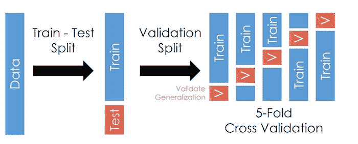
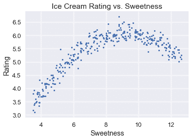
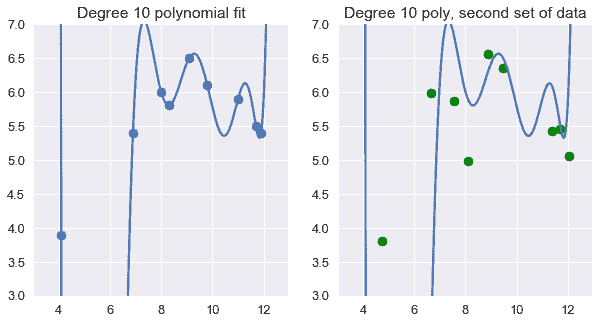
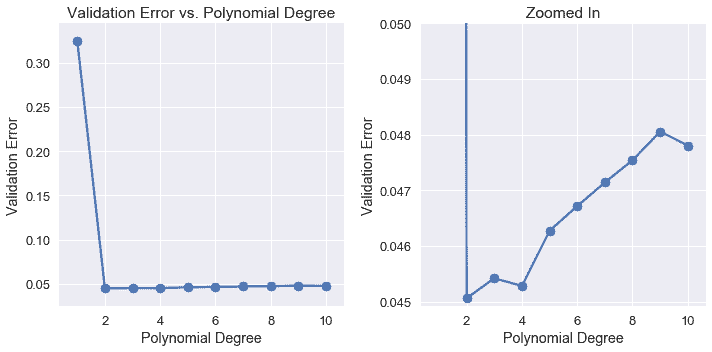

# 交叉验证

> 原文：[https://www.bookmark.ds100.org/ch/15/bias_cv.html](https://www.bookmark.ds100.org/ch/15/bias_cv.html)

```
# HIDDEN
# Clear previously defined variables
%reset -f

# Set directory for data loading to work properly
import os
os.chdir(os.path.expanduser('~/notebooks/15'))

```

```
# HIDDEN
import warnings
# Ignore numpy dtype warnings. These warnings are caused by an interaction
# between numpy and Cython and can be safely ignored.
# Reference: https://stackoverflow.com/a/40846742
warnings.filterwarnings("ignore", message="numpy.dtype size changed")
warnings.filterwarnings("ignore", message="numpy.ufunc size changed")

import numpy as np
import matplotlib.pyplot as plt
import pandas as pd
import seaborn as sns
%matplotlib inline
import ipywidgets as widgets
from ipywidgets import interact, interactive, fixed, interact_manual
import nbinteract as nbi

sns.set()
sns.set_context('talk')
np.set_printoptions(threshold=20, precision=2, suppress=True)
pd.options.display.max_rows = 7
pd.options.display.max_columns = 8
pd.set_option('precision', 2)
# This option stops scientific notation for pandas
# pd.set_option('display.float_format', '{:.2f}'.format)

```

```
# HIDDEN
def df_interact(df, nrows=7, ncols=7):
    '''
    Outputs sliders that show rows and columns of df
    '''
    def peek(row=0, col=0):
        return df.iloc[row:row + nrows, col:col + ncols]
    if len(df.columns) <= ncols:
        interact(peek, row=(0, len(df) - nrows, nrows), col=fixed(0))
    else:
        interact(peek,
                 row=(0, len(df) - nrows, nrows),
                 col=(0, len(df.columns) - ncols))
    print('({} rows, {} columns) total'.format(df.shape[0], df.shape[1]))

```

在前一节中，我们观察到，我们需要一种更精确的方法来模拟测试误差来管理偏差方差权衡。重申一下，由于我们正在将我们的模型拟合到训练集上，因此训练误差非常低。我们需要在不使用测试集的情况下选择一个模型，因此我们再次将我们的培训集分割成一个验证集。交叉验证提供了一种方法，通过将用于培训的数据与用于模型选择和最终精度的数据分离，使用单个观测数据集估计模型误差。

## 列车验证试验拆分

实现这一点的一种方法是将原始数据集拆分为三个不相交的子集：

*   训练集：用于拟合模型的数据。
*   验证集：用于选择功能的数据。
*   测试集：用于报告模型最终精度的数据。

拆分后，我们根据以下步骤选择一组特征和一个模型：

1.  对于每个潜在的功能集，使用训练集拟合模型。模型在训练集上的错误是它的 _ 训练错误 _。
2.  检查验证集上每个模型的错误：其 _ 验证错误 _。选择实现最低验证错误的模型。这是功能和模型的最终选择。
3.  计算测试集上最终模型的 _ 测试误差 _，误差。这是模型的最终报告精度。我们禁止调整特性或模型以减少测试错误；这样做可以有效地将测试集转换为验证集。相反，我们必须在对特性或模型进行进一步更改之后收集一个新的测试集。

这个过程允许我们比单独使用训练错误更准确地确定要使用的模型。通过交叉验证，我们可以在不适合的数据上测试我们的模型，在不使用测试集的情况下模拟测试错误。这让我们了解了我们的模型是如何对看不见的数据执行的。

**列车验证试验段尺寸**

列车验证测试拆分通常使用 70%的数据作为训练集，15%作为验证集，其余 15%作为测试集。增加训练集的大小有助于模型的准确性，但会导致验证和测试错误的更多变化。这是因为较小的验证集和测试集对样本数据的代表性较小。

## 训练错误和测试错误

如果一个模型不能推广到人口中看不见的数据，那么它对我们几乎没有用处。由于我们不使用测试集来训练模型或选择特性，因此测试错误可以最准确地表示模型在新数据上的性能。

一般来说，训练误差会随着模型的复杂度的增加而减小，因为模型具有附加的特性或更复杂的预测机制。另一方面，测试误差降低到一定程度的复杂性，然后随着模型与训练集的过度匹配而再次增加。这是由于这样一个事实：首先，偏差的减少大于方差的增加。最终，方差的增加超过了偏差的减少。

## K-折叠交叉验证

**列车验证测试拆分**方法是通过验证集模拟试验误差的一种好方法。但是，进行三个分割会导致训练数据太少。此外，使用这种方法，验证错误可能会倾向于高方差，因为对错误的评估很大程度上取决于培训和验证集中的结束点。

为了解决这个问题，我们可以在同一个数据集中多次运行列车验证拆分。数据集分为 _k_ 等大小的子集（_$k$folds_），列车验证拆分重复 _k_ 次。每次使用一个 _k_ 折叠作为验证集，剩余的 _k-1_ 折叠用作培训集。我们将模型的最终验证错误报告为每个试验$k$验证错误的平均值。此方法称为**K-折叠交叉验证**。

下图说明了使用五个折叠时的技术：



该方法的最大优点是，每个数据点仅用于一次验证和训练 _K-1_ 次。通常，使用介于 5 到 10 之间的 _k_，但 _k_ 仍是未固定的参数。当 _k_ 很小时，误差估计具有较低的方差（许多验证点），但具有较高的偏差（较少的训练点）。反之，当 _k_ 较大时，误差估计的偏差较小，但方差较大。

$K$折叠交叉验证比火车验证拆分需要更多的计算时间，因为我们通常必须为每个折叠从头重新安装每个模型。但是，它通过对每个模型的多个错误进行平均来计算更精确的验证错误。

`scikit-learn`库提供了一个方便的[`sklearn.model_selection.KFold`](http://scikit-learn.org/stable/modules/generated/sklearn.model_selection.KFold.html)类来实现$k$的交叉验证。

## 偏差方差权衡

交叉验证有助于我们更准确地管理偏差-方差权衡。直观地说，验证错误通过在不用于培训的数据集上检查模型的性能来估计测试错误；这允许我们同时估计模型偏差和模型方差。k 倍交叉验证还包括这样一个事实：测试集中的噪声只影响偏差方差分解中的噪声项，而训练集中的噪声同时影响偏差和模型方差。要选择要使用的最终模型，我们选择验证错误最小的模型。

## 示例：冰淇淋评级的型号选择[¶](#Example:-Model-Selection-for-Ice-Cream-Ratings)

我们将使用完整的模型选择过程，包括交叉验证，来选择一个预测冰淇淋甜度等级的模型。完整的冰淇淋数据集和整体评分与冰淇淋甜度的散点图如下所示。

```
# HIDDEN
ice = pd.read_csv('icecream.csv')
transformer = PolynomialFeatures(degree=2)
X = transformer.fit_transform(ice[['sweetness']])

clf = LinearRegression(fit_intercept=False).fit(X, ice[['overall']])
xs = np.linspace(3.5, 12.5, 300).reshape(-1, 1)
rating_pred = clf.predict(transformer.transform(xs))

temp = pd.DataFrame(xs, columns = ['sweetness'])
temp['overall'] = rating_pred

np.random.seed(42)
x_devs = np.random.normal(scale=0.2, size=len(temp))
y_devs = np.random.normal(scale=0.2, size=len(temp))
temp['sweetness'] = np.round(temp['sweetness'] + x_devs, decimals=2)
temp['overall'] = np.round(temp['overall'] + y_devs, decimals=2)

ice = pd.concat([temp, ice])

```

```
ice

```

|  | 甜度 | 总体的 |
| --- | --- | --- |
| 零 | 3.60 条 | 三点零九 |
| --- | --- | --- |
| 1 个 | 3.50 美元 | 三点一七 |
| --- | --- | --- |
| 二 | 三点六九 | 三点四六 |
| --- | --- | --- |
| …… | …… | ... |
| --- | --- | --- |
| 六 | 十一 | 五点九零 |
| --- | --- | --- |
| 七 | 十一点七零 | 5.50 美元 |
| --- | --- | --- |
| 8 个 | 十一点九零 | 五点四零 |
| --- | --- | --- |

309 行×2 列

```
# HIDDEN
plt.scatter(ice['sweetness'], ice['overall'], s=10)
plt.title('Ice Cream Rating vs. Sweetness')
plt.xlabel('Sweetness')
plt.ylabel('Rating');

```



在数据集中的 9 个随机点上使用 10 次多项式特征，可以得到这些数据点的精确模型。不幸的是，这个模型不能概括为以前从总体中看不到的数据。

```
# HIDDEN
from sklearn.preprocessing import PolynomialFeatures
from sklearn.linear_model import LinearRegression

ice2 = pd.read_csv('icecream.csv')
trans_ten = PolynomialFeatures(degree=10)
X_ten = trans_ten.fit_transform(ice2[['sweetness']])
y = ice2['overall']

clf_ten = LinearRegression(fit_intercept=False).fit(X_ten, y)

```

```
# HIDDEN
np.random.seed(1)
x_devs = np.random.normal(scale=0.4, size=len(ice2))
y_devs = np.random.normal(scale=0.4, size=len(ice2))

plt.figure(figsize=(10, 5))

plt.subplot(121)
plt.scatter(ice2['sweetness'], ice2['overall'])
xs = np.linspace(3.5, 12.5, 1000).reshape(-1, 1)
ys = clf_ten.predict(trans_ten.transform(xs))
plt.plot(xs, ys)
plt.title('Degree 10 polynomial fit')
plt.ylim(3, 7);

plt.subplot(122)
ys = clf_ten.predict(trans_ten.transform(xs))
plt.plot(xs, ys)
plt.scatter(ice2['sweetness'] + x_devs,
            ice2['overall'] + y_devs,
            c='g')
plt.title('Degree 10 poly, second set of data')
plt.ylim(3, 7);

```



代替上述方法，我们首先使用`scikit-learn`'s[`sklearn.model_selection.train_test_split`](http://scikit-learn.org/stable/modules/generated/sklearn.model_selection.train_test_split.html)方法将数据划分为培训、验证和测试数据集，以执行 70/30%的列车测试分割。

```
from sklearn.model_selection import train_test_split

test_size = 92

X_train, X_test, y_train, y_test = train_test_split(
    ice[['sweetness']], ice['overall'], test_size=test_size, random_state=0)

print(f'  Training set size: {len(X_train)}')
print(f'      Test set size: {len(X_test)}')

```

```
  Training set size: 217
      Test set size: 92

```

我们现在使用训练集拟合多项式回归模型，每个多项式阶数从 1 到 10 为一个。

```
from sklearn.linear_model import LinearRegression
from sklearn.preprocessing import PolynomialFeatures

# First, we add polynomial features to X_train
transformers = [PolynomialFeatures(degree=deg)
                for deg in range(1, 11)]
X_train_polys = [transformer.fit_transform(X_train)
                 for transformer in transformers]

# Display the X_train with degree 5 polynomial features
X_train_polys[4]

```

```
array([[     1\.  ,      8.8 ,     77.44,    681.47,   5996.95,  52773.19],
       [     1\.  ,     10.74,    115.35,   1238.83,  13305.07, 142896.44],
       [     1\.  ,      9.98,     99.6 ,    994.01,   9920.24,  99003.99],
       ...,
       [     1\.  ,      6.79,     46.1 ,    313.05,   2125.59,  14432.74],
       [     1\.  ,      5.13,     26.32,    135.01,    692.58,   3552.93],
       [     1\.  ,      8.66,     75\.  ,    649.46,   5624.34,  48706.78]])
```

然后我们将对 10 个特征数据集执行 5 倍交叉验证。为此，我们将定义一个函数：

1.  使用[`KFold.split`](http://scikit-learn.org/stable/modules/generated/sklearn.model_selection.KFold.html)函数获取训练数据的 5 个拆分。请注意，`split`返回该拆分数据的索引。
2.  对于每个拆分，根据拆分索引和特征选择行和列。
3.  在训练分割上拟合线性模型。
4.  计算验证拆分的均方误差。
5.  返回所有交叉验证拆分的平均错误。

```
from sklearn.model_selection import KFold

def mse_cost(y_pred, y_actual):
    return np.mean((y_pred - y_actual) ** 2)

def compute_CV_error(model, X_train, Y_train):
    kf = KFold(n_splits=5)
    validation_errors = []

    for train_idx, valid_idx in kf.split(X_train):
        # split the data
        split_X_train, split_X_valid = X_train[train_idx], X_train[valid_idx]
        split_Y_train, split_Y_valid = Y_train.iloc[train_idx], Y_train.iloc[valid_idx]

        # Fit the model on the training split
        model.fit(split_X_train,split_Y_train)

        # Compute the RMSE on the validation split
        error = mse_cost(split_Y_valid,model.predict(split_X_valid))

        validation_errors.append(error)

    #average validation errors
    return np.mean(validation_errors)

```

```
# We train a linear regression classifier for each featurized dataset and perform cross-validation
# We set fit_intercept=False for our linear regression classifier since 
# the PolynomialFeatures transformer adds the bias column for us.

cross_validation_errors = [compute_CV_error(LinearRegression(fit_intercept=False), X_train_poly, y_train)
                     for X_train_poly in X_train_polys]

```

```
# HIDDEN
cv_df = pd.DataFrame({'Validation Error': cross_validation_errors}, index=range(1, 11))
cv_df.index.name = 'Degree'
pd.options.display.max_rows = 20
display(cv_df)
pd.options.display.max_rows = 7

```

|  | 验证错误 |
| --- | --- |
| 度 |  |
| --- | --- |
| 1 | 0.324820 个 |
| --- | --- |
| 2 | 0.045060 |
| --- | --- |
| 三 | 0.045418 |
| --- | --- |
| 四 | 0.045282 个 |
| --- | --- |
| 5 个 | 0.046272 |
| --- | --- |
| 6 | 0.046715 |
| --- | --- |
| 7 | 0.047140 |
| --- | --- |
| 8 | 0.047540 |
| --- | --- |
| 九 | 0.048055 |
| --- | --- |
| 10 个 | 0.047805 |
| --- | --- |

我们可以看到，当我们使用更高阶多项式特征时，验证误差会减少和增加。

```
# HIDDEN
plt.figure(figsize=(10, 5))

plt.subplot(121)
plt.plot(cv_df.index, cv_df['Validation Error'])
plt.scatter(cv_df.index, cv_df['Validation Error'])
plt.title('Validation Error vs. Polynomial Degree')
plt.xlabel('Polynomial Degree')
plt.ylabel('Validation Error');

plt.subplot(122)
plt.plot(cv_df.index, cv_df['Validation Error'])
plt.scatter(cv_df.index, cv_df['Validation Error'])
plt.ylim(0.044925, 0.05)
plt.title('Zoomed In')
plt.xlabel('Polynomial Degree')
plt.ylabel('Validation Error')

plt.tight_layout();

```



检验验证误差表明，最精确的模型只使用二次多项式特征。因此，我们选择二次多项式模型作为最终模型，并将其一次拟合到所有训练数据上。然后，我们在测试集中计算它的错误。

```
best_trans = transformers[1]
best_model = LinearRegression(fit_intercept=False).fit(X_train_polys[1], y_train)

training_error = mse_cost(best_model.predict(X_train_polys[1]), y_train)
validation_error = cross_validation_errors[1]
test_error = mse_cost(best_model.predict(best_trans.transform(X_test)), y_test)

print('Degree 2 polynomial')
print(f'  Training error: {training_error:0.5f}')
print(f'Validation error: {validation_error:0.5f}')
print(f'      Test error: {test_error:0.5f}')

```

```
Degree 2 polynomial
  Training error: 0.04409
Validation error: 0.04506
      Test error: 0.04698

```

为了将来的参考，`scikit-learn`有一个[`cross_val_predict`](http://scikit-learn.org/stable/modules/generated/sklearn.model_selection.cross_val_predict.html)方法来自动执行交叉验证，所以我们不必自己将数据分解为训练集和验证集。

另外，请注意，测试误差大于验证误差，验证误差大于训练误差。训练误差应该是最小的，因为模型适合训练数据。拟合模型可以最大限度地减少该数据集的均方误差。验证误差和测试误差通常高于训练误差，因为误差是在模型未看到的未知数据集上计算的。

## 摘要[¶](#Summary)

我们使用广泛使用的交叉验证技术来管理偏差-方差权衡。在计算了原始数据集上的列车验证测试分割后，我们使用以下过程来训练和选择模型。

1.  对于每个潜在的功能集，使用训练集拟合模型。模型在训练集上的错误是它的 _ 训练错误 _。
2.  使用$K$交叉验证检查验证集上每个模型的错误：其 _ 验证错误 _。选择实现最低验证错误的模型。这是功能和模型的最终选择。
3.  计算测试集上最终模型的 _ 测试误差 _，误差。这是模型的最终报告精度。我们禁止调整模型以增加测试错误；这样做可以有效地将测试集转换为验证集。相反，我们必须在对模型进行进一步更改之后收集一个新的测试集。