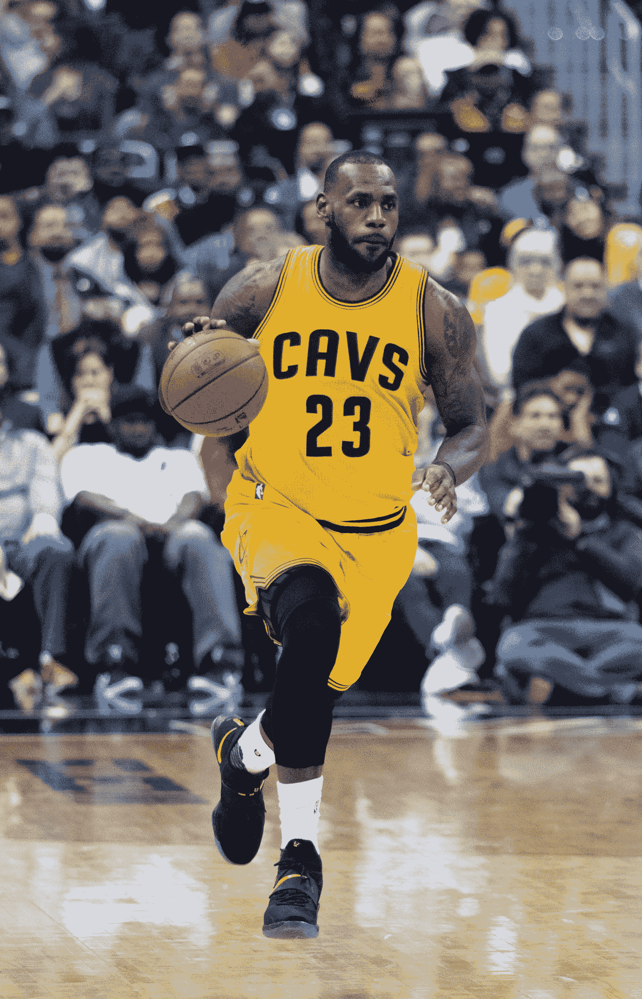
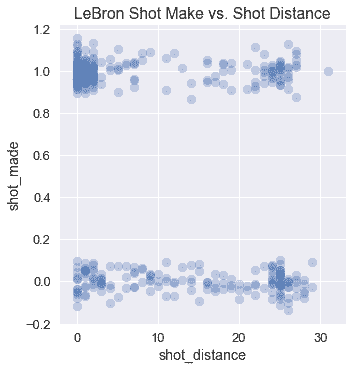
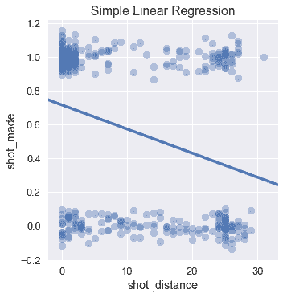
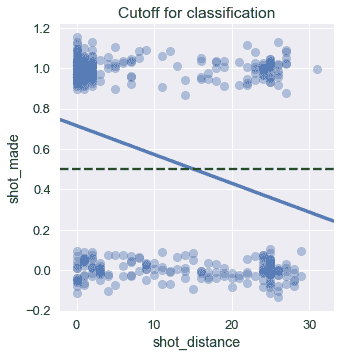

# 概率回归

> 原文：[https://www.bookmark.ds100.org/ch/17/classification_prob.html](https://www.bookmark.ds100.org/ch/17/classification_prob.html)

```
# HIDDEN
# Clear previously defined variables
%reset -f

# Set directory for data loading to work properly
import os
os.chdir(os.path.expanduser('~/notebooks/17'))

```

```
# HIDDEN
import warnings
# Ignore numpy dtype warnings. These warnings are caused by an interaction
# between numpy and Cython and can be safely ignored.
# Reference: https://stackoverflow.com/a/40846742
warnings.filterwarnings("ignore", message="numpy.dtype size changed")
warnings.filterwarnings("ignore", message="numpy.ufunc size changed")

import numpy as np
import matplotlib.pyplot as plt
import pandas as pd
import seaborn as sns
%matplotlib inline
import ipywidgets as widgets
from ipywidgets import interact, interactive, fixed, interact_manual
import nbinteract as nbi

sns.set()
sns.set_context('talk')
np.set_printoptions(threshold=20, precision=2, suppress=True)
pd.options.display.max_rows = 7
pd.options.display.max_columns = 8
pd.set_option('precision', 2)
# This option stops scientific notation for pandas
# pd.set_option('display.float_format', '{:.2f}'.format)

```

```
# HIDDEN
def df_interact(df, nrows=7, ncols=7):
    '''
    Outputs sliders that show rows and columns of df
    '''
    def peek(row=0, col=0):
        return df.iloc[row:row + nrows, col:col + ncols]
    if len(df.columns) <= ncols:
        interact(peek, row=(0, len(df) - nrows, nrows), col=fixed(0))
    else:
        interact(peek,
                 row=(0, len(df) - nrows, nrows),
                 col=(0, len(df.columns) - ncols))
    print('({} rows, {} columns) total'.format(df.shape[0], df.shape[1]))

```

```
# HIDDEN
def jitter_df(df, x_col, y_col):
    x_jittered = df[x_col] + np.random.normal(scale=0, size=len(df))
    y_jittered = df[y_col] + np.random.normal(scale=0.05, size=len(df))
    return df.assign(**{x_col: x_jittered, y_col: y_jittered})

```

在篮球运动中，运动员通过一个篮筐射门得分。其中一位球员，勒布朗·詹姆斯，因其不可思议的得分能力被广泛认为是有史以来最好的篮球运动员之一。



勒布朗在美国超级篮球联盟国家篮球协会（NBA）打球。我们使用 NBA 统计网站（[https://stats.nba.com/](https://stats.nba.com/)）收集了勒布朗在 2017 年 NBA 季后赛中所有尝试的数据集。

```
lebron = pd.read_csv('lebron.csv')
lebron

```

|  | 游戏日期 | 分钟 | 对手 | 动作类型 | 镜头类型 | 射击距离 | 拍摄 |
| --- | --- | --- | --- | --- | --- | --- | --- |
| 零 | 20170415 年 | 10 个 | 因德 | 驾驶上篮得分 | 2pt 现场目标 | 零 | 0 |
| --- | --- | --- | --- | --- | --- | --- | --- |
| 1 个 | 20170415 | 11 个 | IND | Driving Layup Shot | 2PT Field Goal | 0 | 1 个 |
| --- | --- | --- | --- | --- | --- | --- | --- |
| 二 | 20170415 | 十四 | IND | 上篮得分 | 2PT Field Goal | 0 | 1 |
| --- | --- | --- | --- | --- | --- | --- | --- |
| …… | …… | ... | ... | ... | ... | ... | ... |
| --- | --- | --- | --- | --- | --- | --- | --- |
| 三百八十一 | 20170612 年 | 46 岁 | GSW | Driving Layup Shot | 2PT Field Goal | 1 | 1 |
| --- | --- | --- | --- | --- | --- | --- | --- |
| 382 个 | 20170612 | 47 岁 | GSW | 后仰跳投 | 2PT Field Goal | 14 | 0 |
| --- | --- | --- | --- | --- | --- | --- | --- |
| 三百八十三 | 20170612 | 48 岁 | GSW | Driving Layup Shot | 2PT Field Goal | 二 | 1 |
| --- | --- | --- | --- | --- | --- | --- | --- |

384 行×7 列

此数据集的每一行都包含 Lebron 尝试拍摄的照片的以下属性：

*   `game_date`：比赛日期。
*   `minute`：尝试射门的分钟数（每场 NBA 比赛 48 分钟）。
*   `opponent`：勒布朗对手的球队缩写。
*   【HTG0】：镜头前的动作类型。
*   `shot_type'`：放炮类型（2 分或 3 分）。
*   `shot_distance`：勒布朗尝试射门时与篮筐的距离（英尺）。
*   `shot_made`：`0`如果没打中，如果打中，则`1`。

我们想用这个数据集来预测勒布朗是否会在未来出击。这是一个 _ 分类问题 _；我们预测一个类别，而不是像在回归中那样的连续数。

我们可以通过预测一个镜头将进入的 _ 概率 _，将这个分类问题重新定义为一种回归问题。例如，我们预计当勒布朗离篮筐越远时，他投篮的概率就越低。

我们绘制了下面的射门尝试图，显示了 X 轴上与篮筐的距离以及他是否在 Y 轴上射门。稍微抖动 Y 轴上的点可以减少过度绘制。

```
# HIDDEN
np.random.seed(42)
sns.lmplot(x='shot_distance', y='shot_made',
           data=jitter_df(lebron, 'shot_distance', 'shot_made'),
           fit_reg=False,
           scatter_kws={'alpha': 0.3})
plt.title('LeBron Shot Make vs. Shot Distance');

```



我们可以看到，当勒布朗离篮筐只有 5 英尺时，他往往投得最多。一个简单的最小二乘线性回归模型适合这个数据，产生以下预测：

```
# HIDDEN
np.random.seed(42)
sns.lmplot(x='shot_distance', y='shot_made',
           data=jitter_df(lebron, 'shot_distance', 'shot_made'),
           ci=None,
           scatter_kws={'alpha': 0.4})
plt.title('Simple Linear Regression');

```



线性回归预测连续值。但是，要执行分类，我们需要将该值转换为一个类别：放炮或未放炮。我们可以通过设置一个截止值或**分类阈值**来实现这一点。如果回归预测的值大于 0.5，我们预测放炮会发生。否则，我们就预测这次射击会失败。

我们在下面画一条绿色虚线。根据这个截止点，我们的模型预测，如果勒布朗在篮筐 15 英尺以内，他会投篮。

```
# HIDDEN
np.random.seed(42)
sns.lmplot(x='shot_distance', y='shot_made',
           data=jitter_df(lebron, 'shot_distance', 'shot_made'),
           ci=None,
           scatter_kws={'alpha': 0.4})
plt.axhline(y=0.5, linestyle='--', c='g')
plt.title('Cutoff for Classification');

```



在上面的步骤中，我们尝试执行回归来预测一次放炮的可能性。如果我们的回归产生了一个概率，那么设定 0.5 的临界值意味着我们预测当我们的模型认为一个镜头进入的可能性比丢失的镜头更大时，一个镜头会进入。我们将在本章后面重新讨论分类阈值的主题。

## 概率线性回归问题

不幸的是，我们的线性模型的预测不能解释为概率。有效概率必须介于 0 和 1 之间，但我们的线性模型违反了这一条件。例如，当勒布朗距离篮筐 100 英尺时，他投篮的概率应该接近于零。然而，在这种情况下，我们的模型将预测负值。

如果我们改变我们的回归模型，使它的预测可以被解释为概率，我们就不会对使用它的预测进行分类感到不安。我们用一个新的预测函数和一个新的损失函数来实现这一点。生成的模型称为**逻辑模型**。