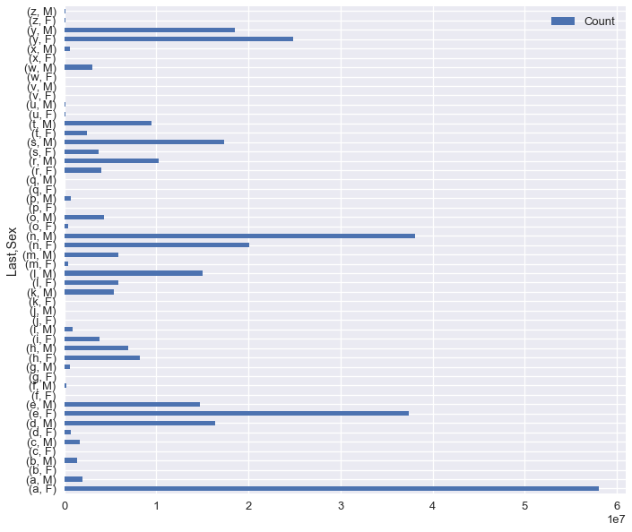
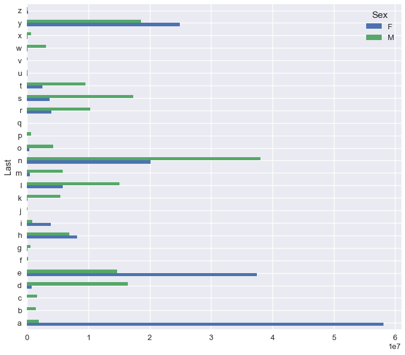
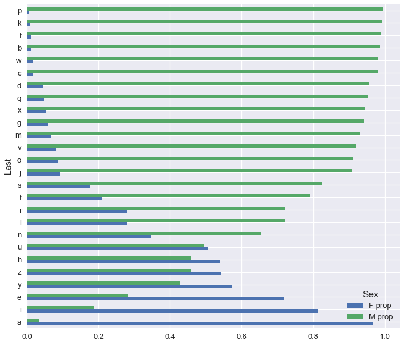

# 三、处理表格数据

> 原文：[DS-100/textbook/notebooks/ch03](https://nbviewer.jupyter.org/github/DS-100/textbook/tree/master/notebooks/ch03/)
> 
> 译者：[飞龙](https://github.com/wizardforcel)
> 
> 协议：[CC BY-NC-SA 4.0](http://creativecommons.org/licenses/by-nc-sa/4.0/)
> 
> 自豪地采用[谷歌翻译](https://translate.google.cn/)

## 索引、切片和排序

### 起步

在本章的每一节中，我们将使用第一章中的婴儿名称数据集。我们将提出一个问题，将问题分解为大体步骤，然后使用`pandas DataFrame`将每个步骤转换为 Python 代码。 我们从导入`pandas`开始：

```py
# pd is a common shorthand for pandas
import pandas as pd
```

现在我们可以使用[`pd.read_csv`](https://pandas.pydata.org/pandas-docs/stable/generated/pandas.read_csv.html)读取数据。

```py
baby = pd.read_csv('babynames.csv')
baby
```

|  | Name | Sex | Count | Year |
| --- | --- | --- | --- | --- |
| 0 | Mary | F | 9217 | 1884 |
| 1 | Anna | F | 3860 | 1884 |
| 2 | Emma | F | 2587 | 1884 |
| ... | ... | ... | ... | ... |
| 1891891 | Verna | M | 5 | 1883 |
| 1891892 | Winnie | M | 5 | 1883 |
| 1891893 | Winthrop | M | 5 | 1883 |

1891894 行 × 4 列

请注意，为了使上述代码正常工作，`babynames.csv`文件必须位于这个笔记本的相同目录中。 通过在笔记本单元格中运行`ls`，我们可以检查当前文件夹中的文件：

```
ls
# babynames.csv                  indexes_slicing_sorting.ipynb
```

当我们使用熊猫来读取数据时，我们得到一个`DataFrame`。 `DataFrame`是一个表格数据结构，其中每列都有标签（这里是`'Name', 'Sex', 'Count', 'Year'`），并且每一行都有标签（这里是`0,1,2, ..., 1891893`）。 然而，Data8 中引入的表格仅包含列标签。

`DataFrame`的标签称为`DataFrame`的索引，并使许多数据操作更容易。

### 索引、切片和排序

让我们使用`pandas`来回答以下问题：

2016 年的五个最受欢迎的婴儿名字是？

#### 拆分问题

我们可以将这个问题分解成以下更简单的表格操作：

+   分割出 2016 年的行。
+   按照计数对行降序排序。

现在，我们可以在`pandas`中表达这些步骤。

#### 使用`.loc`切片

为了选择`DataFrame`的子集，我们使用`.loc`切片语法。 第一个参数是行标签，第二个参数是列标签：

```py
baby
```

| | Name | Sex | Count | Year |
| --- | --- | --- | --- | --- |
| 0 | Mary | F | 9217 | 1884 |
| 1 | Anna | F | 3860 | 1884 |
| 2 | Emma | F | 2587 | 1884 |
| ... | ... | ... | ... | ... |
| 1891891 | Verna | M | 5 | 1883 |
| 1891892 | Winnie | M | 5 | 1883 |
| 1891893 | Winthrop | M | 5 | 1883 |

1891894 行 × 4 列

```py
baby.loc[1, 'Name'] # Row labeled 1, Column labeled 'Name'
# 'Anna'
```

要分割出多行或多列，我们可以使用`:`。 请注意`.loc`切片是包容性的，与 Python 的切片不同。

```py
# Get rows 1 through 5, columns Name through Count inclusive
baby.loc[1:5, 'Name':'Count']
```

|  | Name | Sex | Count |
| --- | --- | --- | --- |
| 1 | Anna | F | 3860 |
| 2 | Emma | F | 2587 |
| 3 | Elizabeth | F | 2549 |
| 4 | Minnie | F | 2243 |
| 5 | Margaret | F | 2142 |

我们通常需要`DataFrame`中的单个列：

```py
baby.loc[:, 'Year']
'''
0          1884
1          1884
2          1884
           ... 
1891891    1883
1891892    1883
1891893    1883
Name: Year, Length: 1891894, dtype: int64
'''
```

请注意，当我们选择一列时，我们会得到一个`pandas`序列。 序列就像一维 NumPy 数组，因为我们可以一次在所有元素上执行算术运算。

```py
baby.loc[:, 'Year'] * 2
'''
0          3768
1          3768
2          3768
           ... 
1891891    3766
1891892    3766
1891893    3766
Name: Year, Length: 1891894, dtype: int64
'''
```

为了选择特定的列，我们可以将列表传递给`.loc`切片：

```py
# This is a DataFrame again
baby.loc[:, ['Name', 'Year']]
```

| | Name | Year |
| --- | --- | --- |
| 0 | Mary | 1884 |
| 1 | Anna | 1884 |
| 2 | Emma | 1884 |
| ... | ... | ... |
| 1891891 | Verna | 1883 |
| 1891892 | Winnie | 1883 |
| 1891893 | Winthrop | 1883 |

1891894 行 × 2 列

选择列很常见，所以存在简写。

```py
# Shorthand for baby.loc[:, 'Name']
baby['Name']
'''
0              Mary
1              Anna
2              Emma
             ...   
1891891       Verna
1891892      Winnie
1891893    Winthrop
Name: Name, Length: 1891894, dtype: object
'''
```

```py
# Shorthand for baby.loc[:, ['Name', 'Count']]
baby[['Name', 'Count']]
```

| | Name | Count |
| --- | --- | --- |
| 0 | Mary | 9217 |
| 1 | Anna | 3860 |
| 2 | Emma | 2587 |
| ... | ... | ... |
| 1891891 | Verna | 5 |
| 1891892 | Winnie | 5 |
| 1891893 | Winthrop | 5 |

1891894 行 × 2 列

**使用谓词对行切片**

为了分割出 2016 年的行，我们将首先创建一个序列，其中每个想要保留的行为`True`，每个想要删除的行为`False`。 这很简单，因为序列上的数学和布尔运算符，应用于序列中的每个元素。

```py
# Series of years
baby['Year']
'''
0          1884
1          1884
2          1884
           ... 
1891891    1883
1891892    1883
1891893    1883
Name: Year, Length: 1891894, dtype: int64
'''
```

```py
# Compare each year with 2016
baby['Year'] == 2016
'''
0          False
1          False
2          False
           ...  
1891891    False
1891892    False
1891893    False
Name: Year, Length: 1891894, dtype: bool
'''
```

一旦我们有了这个`True`和`False`的序列，我们就可以将它传递给`.loc`。

```py
# We are slicing rows, so the boolean Series goes in the first
# argument to .loc
baby_2016 = baby.loc[baby['Year'] == 2016, :]
baby_2016
```

| | Name | Sex | Count | Year |
| --- | --- | --- | --- | --- |
| 1850880 | Emma | F | 19414 | 2016 |
| 1850881 | Olivia | F | 19246 | 2016 |
| 1850882 | Ava | F | 16237 | 2016 |
| ... | ... | ... | ... | ... |
| 1883745 | Zyahir | M | 5 | 2016 |
| 1883746 | Zyel | M | 5 | 2016 |
| 1883747 | Zylyn | M | 5 | 2016 |

32868 行 × 4 列

### 对行排序

下一步是按`'Count'`对行降序排序。 我们可以使用`sort_values()`函数。

```py
sorted_2016 = baby_2016.sort_values('Count', ascending=False)
sorted_2016
```

|  | Name | Sex | Count | Year |
| --- | --- | --- | --- | --- |
| 1850880 | Emma | F | 19414 | 2016 |
| 1850881 | Olivia | F | 19246 | 2016 |
| 1869637 | Noah | M | 19015 | 2016 |
| ... | ... | ... | ... | ... |
| 1868752 | Mikaelyn | F | 5 | 2016 |
| 1868751 | Miette | F | 5 | 2016 |
| 1883747 | Zylyn | M | 5 | 2016 |

32868 行 × 4 列

最后，我们将使用`.iloc`分割出`DataFrame`的前五行。 `.iloc`的工作方式类似`.loc`，但接受数字索引而不是标签。 它的切片中没有包含右边界，就像 Python 的列表切片。

```py
# Get the value in the zeroth row, zeroth column
sorted_2016.iloc[0, 0]
# Get the first five rows
sorted_2016.iloc[0:5]
```

|  | Name | Sex | Count | Year |
| --- | --- | --- | --- | --- |
| 1850880 | Emma | F | 19414 | 2016 |
| 1850881 | Olivia | F | 19246 | 2016 |
| 1869637 | Noah | M | 19015 | 2016 |
| 1869638 | Liam | M | 18138 | 2016 |
| 1850882 | Ava | F | 16237 | 2016 |

### 总结

我们现在拥有了 2016 年的五个最受欢迎的婴儿名称，并且学会了在`pandas`中表达以下操作：

| 操作 | `pandas` |
| --- | --- |
| 读取 CSV 文件 | `pd.read_csv()` |
| 使用标签或索引来切片 | `.loc`和`.iloc` |
| 使用谓词对行切片 | 在`.loc`中使用布尔值的序列 |
| 对行排序 | `.sort_values()` |

## 分组和透视

在本节中，我们将回答这个问题：

每年最受欢迎的男性和女性名称是什么？

这里再次展示了婴儿名称数据集：

```py
baby = pd.read_csv('babynames.csv')
baby.head()
# the .head() method outputs the first five rows of the DataFrame
```

| | Name | Sex | Count | Year |
| --- | --- | --- | --- | --- |
| 0 | Mary | F | 9217 | 1884 |
| 1 | Anna | F | 3860 | 1884 |
| 2 | Emma | F | 2587 | 1884 |
| 3 | Elizabeth | F | 2549 | 1884 |
| 4 | Minnie | F | 2243 | 1884 |

### 拆分问题

我们应该首先注意到，上一节中的问题与这个问题有相似之处；上一节中的问题将名称限制为 2016 年出生的婴儿，而这个问题要求所有年份的名称。

我们再次将这个问题分解成更简单的表格操作。

+   将`baby`表按`'Year'`和`'Sex'`分组。
+   对于每一组，计算最流行的名称。

认识到每个问题需要哪种操作，有时很棘手。通常，一系列复杂的步骤会告诉你，可能有更简单的方式来表达你想要的东西。例如，如果我们没有立即意识到需要分组，我们可能会编写如下步骤：

+   遍历每个特定的年份。
+   对于每一年，遍历每个特定的性别。
+   对于每一个特定年份和性别，找到最常见的名字。

几乎总是有一种更好的替代方法，用于遍历`pandas DataFrame`。特别是，遍历`DataFrame`的特定值，通常应该替换为分组。

#### 分组

为了在`pandas`中进行分组。 我们使用`.groupby()`方法。

```py
baby.groupby('Year')
# <pandas.core.groupby.DataFrameGroupBy object at 0x1a14e21f60>
```

`.groupby()`返回一个奇怪的`DataFrameGroupBy`对象。 我们可以使用聚合函数，在该对象上调用`.agg()`来获得熟悉的输出：

```py
# The aggregation function takes in a series of values for each group
# and outputs a single value
def length(series):
    return len(series)

# Count up number of values for each year. This is equivalent to
# counting the number of rows where each year appears.
baby.groupby('Year').agg(length)
```

|  | Name | Sex | Count |
| --- | --- | --- | --- |
| Year |  |  |  |
| 1880 | 2000 | 2000 | 2000 |
| 1881 | 1935 | 1935 | 1935 |
| 1882 | 2127 | 2127 | 2127 |
| ... | ... | ... | ... |
| 2014 | 33206 | 33206 | 33206 |
| 2015 | 33063 | 33063 | 33063 |
| 2016 | 32868 | 32868 | 32868 |

137 行 × 3 列

你可能会注意到`length`函数只是简单调用了`len`函数，所以我们可以简化上面的代码。

```py
baby.groupby('Year').agg(len)
```

| Name | Sex | Count |
| --- | --- | --- | --- |
| Year |  |  |  |
| 1880 | 2000 | 2000 | 2000 |
| 1881 | 1935 | 1935 | 1935 |
| 1882 | 2127 | 2127 | 2127 |
| ... | ... | ... | ... |
| 2014 | 33206 | 33206 | 33206 |
| 2015 | 33063 | 33063 | 33063 |
| 2016 | 32868 | 32868 | 32868 |

137 行 × 3 列

聚合应用于`DataFrame`的每一列，从而产生冗余信息。 我们可以在分组之前使用切片限制输出列。

```py
year_rows = baby[['Year', 'Count']].groupby('Year').agg(len)
year_rows

# A further shorthand to accomplish the same result:
#
# year_counts = baby[['Year', 'Count']].groupby('Year').count()
#
# pandas has shorthands for common aggregation functions, including
# count, sum, and mean.
```

| | Count |
| --- | --- |
| Year |  |
| 1880 | 2000 |
| 1881 | 1935 |
| 1882 | 2127 |
| ... | ... |
| 2014 | 33206 |
| 2015 | 33063 |
| 2016 | 32868 |

137 行 × 1 列

请注意，生成的`DataFrame`的索引现在包含特定年份，因此我们可以像以前一样，使用`.loc`分割出年份的子集：

```py
# Every twentieth year starting at 1880
year_rows.loc[1880:2016:20, :]
```

|  | Count |
| --- | --- |
| Year |  |
| 1880 | 2000 |
| 1900 | 3730 |
| 1920 | 10755 |
| 1940 | 8961 |
| 1960 | 11924 |
| 1980 | 19440 |
| 2000 | 29764 |

### 多个列的分组

我们在 Data8 中看到，我们可以按照多个列分组，基于唯一值来获取分组。 为此，请将列标签列表传递到`.groupby()`。

```py
grouped_counts = baby.groupby(['Year', 'Sex']).sum()
grouped_counts
```


| | | Count |
| --- | --- | --- |
| Year | Sex |  |
| 1880 | F | 90992 |
| M | 110491 |
| 1881 | F | 91953 |
| ... | ... | ... |
| 2015 | M | 1907211 |
| 2016 | F | 1756647 |
| M | 1880674 |

274 行 × 1 列

上面的代码计算每年每个性别出生的婴儿总数。 现在让我们使用多列分组，来计算每年和每个性别的最流行的名称。 由于数据已按照年和性别的递减顺序排序，因此我们可以定义一个聚合函数，该函数返回每个序列中的第一个值。 （如果数据没有排序，我们可以先调用`sort_values()`。）

```py
# The most popular name is simply the first one that appears in the series
def most_popular(series):
    return series.iloc[0]

baby_pop = baby.groupby(['Year', 'Sex']).agg(most_popular)
baby_pop
```


| | | Name | Count |
| --- | --- | --- | --- |
| Year | Sex |  |  |
| 1880 | F | Mary | 7065 |
| M | John | 9655 |
| 1881 | F | Mary | 6919 |
| ... | ... | ... | ... |
| 2015 | M | Noah | 19594 |
| 2016 | F | Emma | 19414 |
| M | Noah | 19015 |

274 行 × 2 列

注意，多列分组会导致每行有多个标签。 这被称为“多级索引”，并且很难处理。 需要知道的重要事情是，`.loc`接受行索引的元组，而不是单个值：

```py
baby_pop.loc[(2000, 'F'), 'Name']
# 'Emily'
```
但`.iloc`的行为与往常一样，因为它使用索引而不是标签：

```py
baby_pop.iloc[10:15, :]
```

| | | Name | Count |
| --- | --- | --- | --- |
| Year | Sex |  |  |
| 1885 | F | Mary | 9128 |
| M | John | 8756 |
| 1886 | F | Mary | 9889 |
| M | John | 9026 |
| 1887 | F | Mary | 9888 |

#### 透视

如果按两列分组，则通常可以使用数据透视表，以更方便的格式显示数据。 数据透视表可以使用一组分组标签，作为结果表的列。

为了透视，使用`pd.pivot_table()`函数。

```py
pd.pivot_table(baby,
               index='Year',         # Index for rows
               columns='Sex',        # Columns
               values='Name',        # Values in table
               aggfunc=most_popular) # Aggregation function
```

| Sex | F | M |
| --- | --- | --- |
| Year |  |  |
| 1880 | Mary | John |
| 1881 | Mary | John |
| 1882 | Mary | John |
| ... | ... | ... |
| 2014 | Emma | Noah |
| 2015 | Emma | Noah |
| 2016 | Emma | Noah |

137 行 × 2 列

将此结果与我们使用`.groupby()`计算的`baby_pop`表进行比较。 我们可以看到`baby_pop`中的`Sex`索引成为了数据透视表的列。

```py
baby_pop
```

| | | Name | Count |
| --- | --- | --- | --- |
| Year | Sex |  |  |
| 1880 | F | Mary | 7065 |
| M | John | 9655 |
| 1881 | F | Mary | 6919 |
| ... | ... | ... | ... |
| 2015 | M | Noah | 19594 |
| 2016 | F | Emma | 19414 |
| M | Noah | 19015 |

274 行 × 2 列

### 总结

我们现在有了数据集中每个性别和年份的最受欢迎的婴儿名称，并学会了在`pandas`中表达以下操作：

| 操作 | `pandas` |
| --- | --- |
| 分组 | `df.groupby(label)` |
| 多列分组 | `df.groupby([label1, label2])` |
| 分组和聚合 | `df.groupby(label).agg(func)` |
| 透视 | `pd.pivot_table()` |

## 应用、字符串和绘图

在本节中，我们将回答这个问题：

我们可以用名字的最后一个字母来预测婴儿的性别吗？

这里再次展示了婴儿名称数据集：

```py
baby = pd.read_csv('babynames.csv')
baby.head()
# the .head() method outputs the first five rows of the DataFrame
```

| | Name | Sex | Count | Year |
| --- | --- | --- | --- | --- |
| 0 | Mary | F | 9217 | 1884 |
| 1 | Anna | F | 3860 | 1884 |
| 2 | Emma | F | 2587 | 1884 |
| 3 | Elizabeth | F | 2549 | 1884 |
| 4 | Minnie | F | 2243 | 1884 |

### 拆解问题

虽然有很多方法可以预测是否可能，但我们将在本节中使用绘图。 我们可以将这个问题分解为两个步骤：

+   计算每个名称的最后一个字母。
+   按照最后一个字母和性别分组，使用计数来聚合。
+   绘制每个性别和字母的计数。

### 应用

`pandas`序列包含`.apply()`方法，它接受一个函数并将其应用于序列中的每个值。

```py
names = baby['Name']
names.apply(len)
'''
0          4
1          4
2          4
          ..
1891891    5
1891892    6
1891893    8
Name: Name, Length: 1891894, dtype: int64
'''
```

为了提取每个名字的最后一个字母，我们可以定义我们自己的函数来传入`.apply()`：

```py
def last_letter(string):
    return string[-1]

names.apply(last_letter)
'''
0          y
1          a
2          a
          ..
1891891    a
1891892    e
1891893    p
Name: Name, Length: 1891894, dtype: object
'''
```

### 字符串操作

虽然`.apply()`是灵活的，但在处理文本数据时，在使用`pandas`内置的字符串操作函数通常会更快。

`pandas`通过序列的`.str`属性，提供字符串操作函数。

```py
names = baby['Name']
names.str.len()
'''
0          4
1          4
2          4
          ..
1891891    5
1891892    6
1891893    8
Name: Name, Length: 1891894, dtype: int64
'''
```

我们可以用类似的方式，直接分离出每个名字的最后一个字母。

```py
names.str[-1]
'''
0          y
1          a
2          a
          ..
1891891    a
1891892    e
1891893    p
Name: Name, Length: 1891894, dtype: object
'''
```

我们建议查看文档来获取[字符串方法的完整列表](https://pandas.pydata.org/pandas-docs/stable/text.html)。

我们现在可以将最后一个字母的这一列添加到我们的婴儿数据帧中。

```py
baby['Last'] = names.str[-1]
baby
```

| | Name | Sex | Count | Year | Last |
| --- | --- | --- | --- | --- | --- |
| 0 | Mary | F | 9217 | 1884 | y |
| 1 | Anna | F | 3860 | 1884 | a |
| 2 | Emma | F | 2587 | 1884 | a |
| ... | ... | ... | ... | ... | ... |
| 1891891 | Verna | M | 5 | 1883 | a |
| 1891892 | Winnie | M | 5 | 1883 | e |
| 1891893 | Winthrop | M | 5 | 1883 | p |

1891894 行 × 5 列

### 分组

为了计算每个最后一个字母的性别分布，我们需要按`Last`和`Sex`分组。

```py
# Shorthand for baby.groupby(['Last', 'Sex']).agg(np.sum)
baby.groupby(['Last', 'Sex']).sum()
```

| | | Count | Year |
| --- | --- | --- | --- |
| Last | Sex |  |  |
| a | F | 58079486 | 915565667 |
| M | 1931630 | 53566324 |
| b | F | 17376 | 1092953 |
| ... | ... | ... | ... |
| y | M | 18569388 | 114394474 |
| z | F | 142023 | 4268028 |
| M | 120123 | 9649274 |

52 行 × 2 列

请注意，因为每个没有用于分组的列都传递到聚合函数中，所以也求和了年份。 为避免这种情况，我们可以在调用`.groupby()`之前选择所需的列。

```py
# When lines get long, you can wrap the entire expression in parentheses
# and insert newlines before each method call
letter_dist = (
    baby[['Last', 'Sex', 'Count']]
    .groupby(['Last', 'Sex'])
    .sum()
)
letter_dist
```


| | | Count |
| --- | --- | --- |
| Last | Sex |  |
| a | F | 58079486 |
| M | 1931630 |
| b | F | 17376 |
| ... | ... | ... |
| y | M | 18569388 |
| z | F | 142023 |
| M | 120123 |

52 行 × 1 列

### 绘图

`pandas`为大多数基本绘图提供了内置的绘图函数，包括条形图，直方图，折线图和散点图。 为了从`DataFrame`中绘制图形，请使用`.plot`属性：

```py
# We use the figsize option to make the plot larger
letter_dist.plot.barh(figsize=(10, 10))
# <matplotlib.axes._subplots.AxesSubplot at 0x1a17af4780>
```



虽然这个绘图显示了字母和性别的分布，但是男性和女性的条形很难分开。 通过在`pandas`文档中查看[绘图](https://pandas.pydata.org/pandas-docs/stable/visualization.html)，我们了解到`pandas`将`DataFrame`的一行中的列绘制为一组条形，并将每列显示为不同颜色的条形。 这意味着`letter_dist`表的透视版本将具有正确的格式。

```py
letter_pivot = pd.pivot_table(
    baby, index='Last', columns='Sex', values='Count', aggfunc='sum'
)
letter_pivot
```

| | Sex | F | M |
| --- | --- | --- | --- |
| Last |  |  |
| a | 58079486 | 1931630 |
| b | 17376 | 1435939 |
| c | 30262 | 1672407 |
| ... | ... | ... |
| x | 37381 | 644092 |
| y | 24877638 | 18569388 |
| z | 142023 | 120123 |

26 行 × 2 列

```py
letter_pivot.plot.barh(figsize=(10, 10))
# <matplotlib.axes._subplots.AxesSubplot at 0x1a17c36978>
```



请注意，`pandas`为我们生成了图例，这很方便 但是，这仍然难以解释。 我们为每个字母和性别绘制了计数，这些计数会导致一些条形看起来很长，而另一些几乎看不见。 相反，我们应该绘制每个最后一个字母的男性和女性的比例。

```py
total_for_each_letter = letter_pivot['F'] + letter_pivot['M']

letter_pivot['F prop'] = letter_pivot['F'] / total_for_each_letter
letter_pivot['M prop'] = letter_pivot['M'] / total_for_each_letter
letter_pivot
```


| Sex | F | M | F prop | M prop |
| --- | --- | --- | --- | --- |
| Last |  |  |  |  |
| a | 58079486 | 1931630 | 0.967812 | 0.032188 |
| b | 17376 | 1435939 | 0.011956 | 0.988044 |
| c | 30262 | 1672407 | 0.017773 | 0.982227 |
| ... | ... | ... | ... | ... |
| x | 37381 | 644092 | 0.054853 | 0.945147 |
| y | 24877638 | 18569388 | 0.572597 | 0.427403 |
| z | 142023 | 120123 | 0.541771 | 0.458229 |

26 行 × 4 列

```py
(letter_pivot[['F prop', 'M prop']]
 .sort_values('M prop') # Sorting orders the plotted bars
 .plot.barh(figsize=(10, 10))
)
# <matplotlib.axes._subplots.AxesSubplot at 0x1a18194b70>
```



### 总结

我们可以看到几乎所有以`'p'`结尾的名字都是男性，以`'a'`结尾的名字都是女性！ 一般来说，许多字母的条形长度之间的差异意味着，如果我们只知道他们的名字的最后一个字母，我们往往可以准确猜测一个人的性别。

我们已经学会在`pandas`中表达以下操作：

| 操作 | `pandas` |
| --- | --- |
| 逐元素应用函数 | `series.apply(func)` |
| 字符串操作 | `series.str.func()` |
| 绘图 | `df.plot.func()` |
